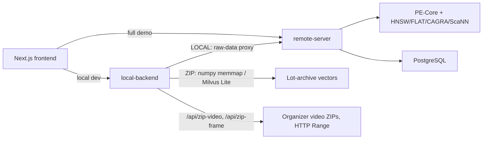
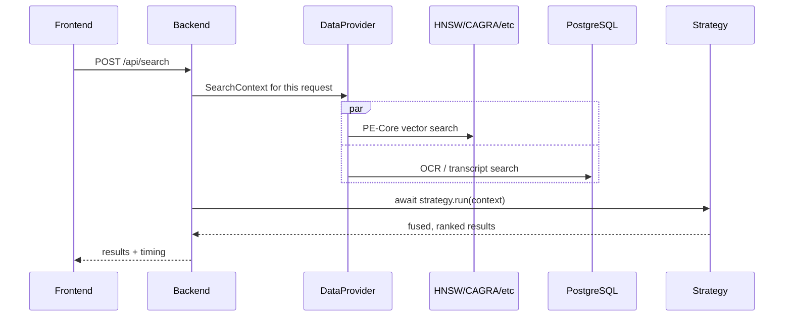

# Architecture

The mental model needed to reason about the system without reading code.
Deep dives (module-by-module request path, byte-range media serving
internals, full DB schema) moved to [docs/archive/](archive/) — this page
stays to the essentials.

## Overview

The frontend calls one FastAPI backend, selected via `NEXT_PUBLIC_API_URL`:
`local-backend` for local dev, `remote-server` for the full demo.



`local-backend` and `remote-server` expose the same strategy contract and
API surface — a strategy file runs unmodified on either. The split is
deliberate: `remote-server` carries the heavy/real workload (full Milvus,
CAGRA, full video), `local-backend` only ever gets lighter workaround
mechanisms cheap enough for a laptop (Milvus Lite, ZIP Range-proxy). Don't
"upgrade" local-backend to match remote-server's weight — that's not a gap,
it's the design.

## ENV_MODE

Set in each backend's `.env`, controls where data comes from:

| Value | Runs on | DataProvider does |
|---|---|---|
| `ZIP` | Contestant laptop | Searches vectors exported from the lot archives — memmapped `vectors.f32.npy` (exact, preferred), else Milvus Lite FLAT |
| `LOCAL` | Contestant laptop | Proxies raw-data requests to `REMOTE_SERVER_URL`; also proxies `/api/zip-video`, `/api/zip-frame` |
| `SERVER` | GPU workstation | Real Milvus + PostgreSQL (or, dev/test-only, embedded Milvus Lite via `MILVUS_LITE_PATH`) |

Switching `ZIP` → `LOCAL` needs zero strategy-file changes — only the `.env`.

## Request lifecycle



Near-duplicate frames (same shot held for seconds) are filtered
automatically around every strategy — `BaseStrategy.search()` wraps
`run(context)`, drops near-identical results by embedding similarity, and
refetches more pages until `top_k` is satisfied. A strategy never has to
know this exists.

## Media: YouTube-first, ZIP-proxy fallback

```text
youtube_id present and embed not failed  → YouTube IFrame player
otherwise                                 → GET /api/zip-video/{video_id}
```

Both backends serve `/api/zip-frame` and `/api/zip-video` by reading exact
byte ranges out of the organizers' `Videos_L*.zip` archives — no unpacking,
no full download. `remote-server` always seeks its own local copy under
`challenge_resources/data/raw_zip_videos/` (only `Videos_L30_a.zip` is present
there today — other lots 404 and fall back to YouTube on that machine).
`local-backend` defaults to HTTP Range against the organizer's host
(`ZIP_MEDIA_SOURCE=remote`) but can read a local copy the same way
`remote-server` does (`ZIP_MEDIA_SOURCE=local`) — for when it runs on a
machine that already holds the archives, no network fetch needed. Same
routes, same response shapes either way. Full mechanism (MP4 box parsing,
`moov` caching, concurrency knobs): [archive/zip_media.md](archive/zip_media.md).

## Guardrails (always enforced)

| Guardrail | Value |
|---|---|
| Fetch cap | 1000 hits max per retrieval/response |
| Execution timeout | 30s per strategy run |
| Top K cap | user-controlled, default 100, max 1000 |

## Known limitations worth knowing before a demo

- `transcript.semantic` / `subtitled.semantic` only exist in `LOCAL` and
  `SERVER` modes — the local lot archives carry no transcript index, so a
  strategy assuming all four channels breaks in plain `ZIP` mode. The
  dedicated Transcripts search tab (`POST /api/search/transcript`) is a
  different code path and does work in `ZIP` mode — fuzzy match (rapidfuzz)
  against cached transcripts, not vector/topic search, no strategy involved.
- `remote-server` only has `Videos_L30_a.zip` on disk — every other lot
  falls back to YouTube playback there (`local-backend` reaches all lots
  fine, over HTTP Range).
- A strategy that truly infinite-loops isn't killed by the 30s timeout —
  the response is cancelled but the worker thread keeps running until
  restart.

Full list, including code-location pointers: [archive/gaps.md](archive/gaps.md).
