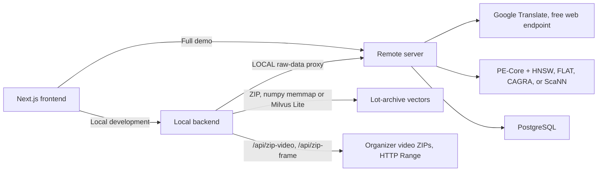
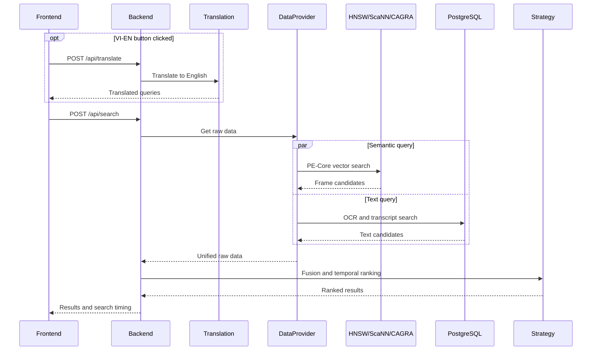

# System Architecture

Why the system is shaped this way. For *where the code is* — startup
order, the request path file by file, the endpoint map — see
[backend_flow.md](backend_flow.md).

## Overview

The frontend calls one FastAPI backend selected through
`NEXT_PUBLIC_API_URL`. For the full demo it calls `remote-server` directly.
For local strategy development it calls `local-client/local-backend`.



Both backends can also read/write an embedded **Milvus Lite** file
(`challenge_resources/data/milvus_lite.db`, no Docker/server process) — set
`MILVUS_LITE_PATH` in either `.env` to point at it (needs `pymilvus>=2.4`,
a separate opt-in install — see `requirements-milvus-lite.txt` in each
backend). On `remote-server` this is **dev/test-only**: a way to run and test
`remote-server` code on a laptop without Docker or a real Milvus server — the
production path is still a real Milvus server (`docker compose up`, base
`requirements.txt` pins `pymilvus==2.3.7` for it). On `local-backend`, Milvus
Lite is now only a **fallback**: `SAMPLE` mode prefers exact search over the
memmapped `vectors.f32.npy` that sits next to that database
(`app/db/numpy_vector_store.py`, ~45x faster than Milvus Lite's own brute
force over the same bytes), then Milvus Lite's FLAT index, then a linear
`.npy` scan. `MILVUS_LITE_PATH` is still the setting that points at the data
directory in all three cases. This is the local/remote weight
split: remote carries the heavier, GPU/full-dataset workload (full Milvus,
CAGRA, full video, direct frame/video search); local-backend's mechanisms
(Milvus Lite, the ZIP-Range proxy) are lighter work-arounds that only aim to
make local dev cheap and fast, not to replace the server.

The local and remote backends expose the same strategy lifecycle and local
translation endpoint. CAGRA remains a remote-server feature.

In the full demo, strategy presets on the remote server are read-only. Each
machine's Next.js frontend stores its tuning draft under `.runtime/` and sends
it as request-scoped `config_overrides`; the remote validates and uses it
without writing shared state. Desktop and phone share a draft only when they
open the same machine's frontend.

---

## ENV_MODE

The `ENV_MODE` environment variable controls where data comes from. Set it in the `.env` file.

| Value | Where it runs | What DataProvider does |
|---|---|---|
| `ZIP` | Contestant laptop | Searches the vectors exported from the lot archives: memmapped `vectors.f32.npy` (exact, preferred), else Milvus Lite FLAT — see [backend_flow.md](backend_flow.md#1-startup) |
| `LOCAL` | Contestant laptop | Proxies raw-data requests to `REMOTE_SERVER_URL`; also runs the `/api/zip-video`, `/api/zip-frame` proxy for organizer-ZIP playback |
| `SERVER` | GPU workstation | Connects to a real Milvus server + PostgreSQL (or, dev/test-only, embedded Milvus Lite via `MILVUS_LITE_PATH` — see above) |

`MOCK` and `SAMPLE` are gone. They read the older `AIC2026_sample` layout
(`keyframes/`, `metadata/`, `PECore-features/` — nine L01–L03 videos) plus JSON
fixtures, none of which overlap the ~193k vectors actually indexed. Describing
videos nobody could search for made "my query returns nothing" ambiguous, which
cost more than the fixtures were worth. That data now sits in
`challenge_resources/data/_legacy_aic2026_sample/`, unread by any code path.

### Switching from ZIP to LOCAL

Edit `local-client/local-backend/.env`:

```env
ENV_MODE=LOCAL
REMOTE_SERVER_URL=https://your-ngrok-url.ngrok.io
```

The strategy files require **zero changes** when switching modes. Only the `.env` file changes.

---

## Request Lifecycle



The VI→EN button calls Google Translate's free, unofficial web endpoint (via
the `deep-translator` library — no API key, no local model download) and
replaces the semantic input with the English result. Search never triggers
translation. Translations and PE-Core text embeddings use bounded in-process
caches (`lru_cache`, 256 entries for translation).

## Production Search Backends

`VECTOR_SEARCH_BACKEND` selects the visual index:

| Value | Behavior |
|---|---|
| `milvus` / `hnsw` | Milvus HNSW ANN search using COSINE similarity |
| `flat` | Milvus FLAT exact CPU search using COSINE similarity |
| `scann` | Milvus ScaNN approximate search using raw vector reordering |
| `cagra` | Optional cuVS CAGRA search using a local GPU index |

Milvus runtime algorithm selection uses one collection per index profile, for
example `video_frames` for HNSW, `video_frames_flat` for FLAT, and `video_frames_scann` for ScaNN. This keeps
runtime switching real while still using Milvus search for these algorithms.
CAGRA changes only semantic vector search. Milvus and PostgreSQL still run for
collection access, metadata, OCR, transcripts, and temporal workflows.

### Legacy V1 raw data shape (archived)

The shape below documents the archived `app/archive_v1/strategies` path only.
Active strategies use `SearchContext` and channel hits; see
[strategy_v2.md](strategy_v2.md).

Every strategy receives the same `raw_data` dict regardless of mode:

```python
{
    "frames": [
        {
            "frame_id":     "dQw4w9WgXcQ_000025",
            "video_id":     "dQw4w9WgXcQ",
            "frame_number": 25,
            "timestamp_ms": 1000,
            "image_url":    "https://..."   # or /static/frames/... on server
        },
        ...
    ],
    "ocr": [
        {
            "frame_id":     "dQw4w9WgXcQ_000025",
            "video_id":     "dQw4w9WgXcQ",
            "frame_number": 25,
            "timestamp_ms": 1000,
            "ocr_text":     "BREAKING NEWS: City Center"
        },
        ...
    ],
    "transcripts": [
        {
            "video_id":      "dQw4w9WgXcQ",
            "start_time_ms": 0,
            "end_time_ms":   4000,
            "text":          "Floodwaters have reached the city centre..."
        },
        ...
    ],
    "videos": {
        "dQw4w9WgXcQ": {
            "video_id":    "dQw4w9WgXcQ",
            "title":       "Mock Video — City Street Scene",
            "youtube_id":  "dQw4w9WgXcQ",
            "fps":         25.0,
            "duration_ms": 212000,
            "frame_count": 5300
        },
        ...
    }
}
```

---

## Video Playback: YouTube-first, ZIP-proxy fallback

`VideoModal.tsx` always prefers the YouTube IFrame player when a hit has a
`youtube_id` (denormalized into Milvus at ingest time so both backends can
read it without a PostgreSQL round trip). Only when YouTube has no ID, or the
player itself reports an error (`onError` — private/removed/embed-disabled),
does it fall back to a native `<video>` element streamed from the organizers'
ZIP archives:

```text
youtube_id present and embed not yet failed → YouTube IFrame
otherwise                                    → GET /api/zip-video/{video_id}      (local-backend only)
```

`local-client/local-backend/app/services/remote_zip_proxy.py` translates an
incoming byte-range request into an HTTP Range request against the correct
offset inside the organizer's `Videos_L*.zip` (via a pre-built
`zip_video_index.json` manifest, `scripts/build_zip_video_index.py`) — no
download of the whole archive or whole video.

Frame thumbnails (`GET /api/zip-frame/{video_id}/{timestamp_ms}`) go through
`app/services/zip_frame_source.py`, which ports the organizers'
`remote_zip_video_toolkit` MP4-box/sample-table parser
(`app/services/mp4_box_parser.py`) to compute the exact byte range and sample
index for one frame, fetches only that range, converts AVCC → Annex-B, and
decodes it with ffmpeg (`select=eq(n,target_index)`) — one Range request per
frame instead of pointing ffmpeg at a URL (which reprobes the container on
every call and falls over under concurrency).

Before any frame of a video can be decoded, its `moov` box has to be
downloaded and parsed — roughly 1 MB per video. A result grid spanning 30
distinct videos therefore pulls ~30 MB from the organizer's host before the
first thumbnail appears, and measurement showed this, not concurrency, is the
wall: a cold 60-thumbnail grid took ~45s at both 6 and 12 in-flight requests,
and *worse* (60s) at 32, because the extra parallelism only spread the same
bandwidth thinner. `moov` never changes, so it is cached on disk under
`cache/zip_moov/` (`ZIP_MOOV_CACHE_DIR` to relocate) — the same grid after a
backend restart takes 18s with no timeouts.

The two costs are throttled separately, because they are different resources:
`ZIP_FRAME_DECODE_CONCURRENCY` (default 6) caps ffmpeg processes, which are
CPU-bound, while `ZIP_FRAME_CONCURRENCY` (default 12) caps requests in flight
on the route. Capping both at one number made per-video `moov` downloads
queue behind ffmpeg.

Both routes fetch through `app/services/range_http_client.py`
(`RangeHTTPClient`): retries transient upstream failures (timeouts, resets,
HTTP 429/5xx) with exponential backoff, and raises a typed
`RangeFetchError`/`ZipFrameUnavailable` instead of letting a raw exception
propagate. Only `/api/zip-frame` wraps its work in `asyncio.wait_for`
(`ZIP_FRAME_TIMEOUT_SEC`, 45s — covers the whole `async with
_zip_frame_semaphore: ...` block, including queue wait, since the wrapped
coroutine hasn't started running until `wait_for` drives it) plus a catch-all
handler, so a broken upstream always returns a clean `502`/`504`/`500`
instead of hanging with no response. `/api/zip-video` streams the response
body directly (`StreamingResponse`) and isn't a good fit for a fixed overall
timeout — its resilience is the `RangeHTTPClient` retry on the initial
connection open; a slow/stalled *stream* isn't currently bounded.

**Both backends serve these routes now**, from the same MP4 sample-table code
with a different fetch layer: `local-backend` issues HTTP Range requests to the
organizers' host, `remote-server` seeks in its own copy of `Videos_L*.zip` under
`challenge_resources/data/raw_zip/` (`app/services/local_zip_media.py`). That
split is the local/remote weight split again — the server carries the load on
its own disk rather than adding a network dependency on the same external host
local-backend already leans on, and in exchange it needs none of the retry,
moov-cache or region-cache machinery that exists purely to survive that network.

The remaining constraint is data, not code: only `Videos_L30_a.zip` has been
downloaded to `raw_zip/` so far, so `remote-server` serves media for L30 and
404s the rest, which the frontend treats as "fall back to YouTube". Full
walkthrough: [zip_media.md](zip_media.md).

`image_url` for Milvus-backed hits is never stored at ingest time — it's
derived at read time from `video_id` + `timestamp_ms`
(`data_provider.py` rewrites it to `/api/zip-frame/{video_id}/{timestamp_ms}`)
so it can't go stale when the serving mechanism changes.

---

## Duplicate-Result Filtering

Visually near-identical frames (the same shot held for several seconds)
routinely fill a result page with near-duplicates. `SearchRequest.duplicate_threshold`
(0.0–1.0, default `0.98`, exposed as a slider in the frontend's results
header) controls how aggressively they're collapsed.

`BaseStrategy.search()` wraps every strategy's `run(context)` in
`_run_with_filter()`:

1. Run the strategy once to get ranked results.
2. Collect the `frame_id`s from every result (including each step of a
   multi-step/temporal result via `result_frame_ids()`), fetch their raw
   embeddings with `context.frame_embeddings(frame_ids)` (`/api/frame-embeddings`,
   batched, cached per-request), and run
   `app/strategies/_similarity_filter.py::filter_similar_results()` — a
   greedy, sequence-aware pass that drops a result only when *every*
   corresponding step's cosine similarity to an already-kept result exceeds
   the threshold (optionally weighted per step via `event_weights`).
3. If filtering leaves fewer than `top_k` results, call
   `context.request_more_results()` to pull another page — `SearchContext.retrieve()`
   caches per-channel results and pages forward using `exclude_frame_ids` so
   the next `run(context)` call doesn't re-fetch what was already seen — and
   repeat, until the page is full or the channel is exhausted (`FETCH_CAP = 1000`).

This machinery lives entirely in `SearchContext`/`BaseStrategy`; individual
strategies don't need to know about it beyond accepting the
`duplicate_threshold` param passed through from the request.

---

## Strategy Auto-Discovery

On startup the backend scans `app/strategies/*.py` and auto-registers any class that:
- Inherits from `BaseStrategy`
- Is **not** `BaseStrategy` itself
- Has non-empty `name`, `description`, and `author` class attributes

The file stem becomes the `strategy_id` (e.g. `custom_strategy_v1.py` → `"custom_strategy_v1"`).

A reload of the backend (or `--reload` watching the `.py` file) is all that's needed to pick up a new strategy.

---

## Guardrails (always enforced)

| Guardrail | Value | Where enforced |
|---|---|---|
| Fetch cap | 1000 hits max per retrieval/final response | `SearchContext` + `BaseStrategy.search()` |
| Execution timeout | 30 seconds | `asyncio.wait_for(strategy.run(context), timeout=30)` |
| Top K cap | User-controlled (default 100, max 1000) | `main.py` slices `results[:top_k]` before returning |

The timeout cancels the HTTP response but does not forcibly kill the worker thread. If a strategy has a true infinite loop the thread will continue in the background until the process restarts. This is acceptable for a development playground.

---

## Promoting a Strategy to Production

1. Test your strategy locally until satisfied with the score
2. Copy the file verbatim to `remote-server/app/strategies/yourname_v2.py`
3. Restart the remote server
4. Select it in the frontend dropdown

No other changes needed. The `DataProvider` on the server handles all DB connections transparently.
