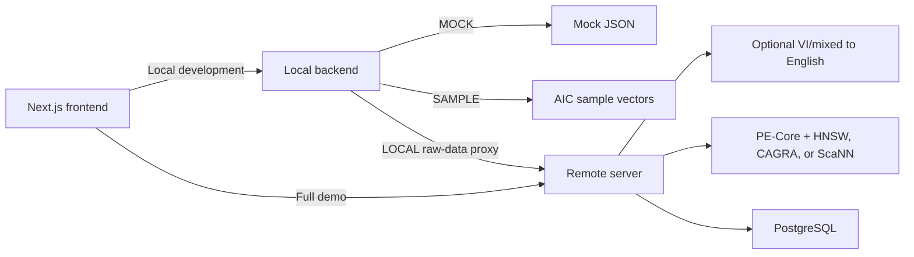
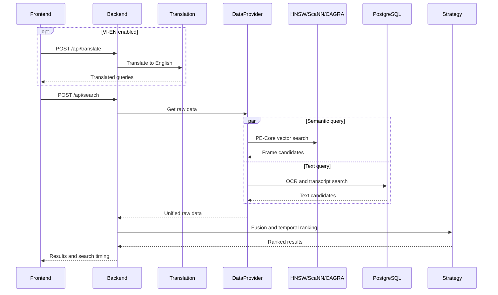

# System Architecture

## Overview

The frontend calls one FastAPI backend selected through
`NEXT_PUBLIC_API_URL`. For the full demo it calls `remote-server` directly.
For local strategy development it calls `local-client/local-backend`.



The local and remote backends expose the same strategy lifecycle. Translation
and CAGRA are remote-server features; the simple local MOCK/SAMPLE backend does
not provide the translation endpoint.

---

## ENV_MODE

The `ENV_MODE` environment variable controls where data comes from. Set it in the `.env` file.

| Value | Where it runs | What DataProvider does |
|---|---|---|
| `MOCK` | Contestant laptop | Reads `app/mock/*.json` — no server needed |
| `SAMPLE` | Contestant laptop | Searches local `AIC2026_sample` PE-Core vectors |
| `LOCAL` | Contestant laptop | Proxies raw-data requests to `REMOTE_SERVER_URL` |
| `SERVER` | GPU workstation | Connects directly to local Milvus + PostgreSQL |

### Switching from MOCK to LOCAL

Edit `local-client/local-backend/.env`:

```env
ENV_MODE=LOCAL
REMOTE_SERVER_URL=https://your-ngrok-url.ngrok.io
```

The strategy files require **zero changes** when switching modes. Only the `.env` file changes.

---

## Request Lifecycle



The translation provider is configured by `TRANSLATION_PROVIDER` on the remote
backend and is not selectable in the UI. Exact translated queries and PE-Core
text embeddings use bounded in-process caches. Optional startup warmups avoid
model/client initialization during the first user request.

## Production Search Backends

`VECTOR_SEARCH_BACKEND` selects the visual index:

| Value | Behavior |
|---|---|
| `milvus` / `hnsw` | Milvus HNSW ANN search using COSINE similarity |
| `flat` | Milvus FLAT exact CPU search using COSINE similarity |
| `scann` | Milvus ScaNN approximate search using raw vector reordering |
| `cagra` | Optional cuVS CAGRA search using a local GPU index |

Milvus runtime algorithm selection uses one collection per index profile, for
example `video_frames` for HNSW, `video_frames_flat` for FLAT, and `video_frames_scann` for ScaNN. This keeps
runtime switching real while still using Milvus search for these algorithms.
CAGRA changes only semantic vector search. Milvus and PostgreSQL still run for
collection access, metadata, OCR, transcripts, and temporal workflows.

### Raw data shape

Every strategy receives the same `raw_data` dict regardless of mode:

```python
{
    "frames": [
        {
            "frame_id":     "dQw4w9WgXcQ_000025",
            "video_id":     "dQw4w9WgXcQ",
            "frame_number": 25,
            "timestamp_ms": 1000,
            "image_url":    "https://..."   # or /static/frames/... on server
        },
        ...
    ],
    "ocr": [
        {
            "frame_id":     "dQw4w9WgXcQ_000025",
            "video_id":     "dQw4w9WgXcQ",
            "frame_number": 25,
            "timestamp_ms": 1000,
            "ocr_text":     "BREAKING NEWS: City Center"
        },
        ...
    ],
    "transcripts": [
        {
            "video_id":      "dQw4w9WgXcQ",
            "start_time_ms": 0,
            "end_time_ms":   4000,
            "text":          "Floodwaters have reached the city centre..."
        },
        ...
    ],
    "videos": {
        "dQw4w9WgXcQ": {
            "video_id":    "dQw4w9WgXcQ",
            "title":       "Mock Video — City Street Scene",
            "youtube_id":  "dQw4w9WgXcQ",
            "fps":         25.0,
            "duration_ms": 212000,
            "frame_count": 5300
        },
        ...
    }
}
```

---

## Strategy Auto-Discovery

On startup the backend scans `app/strategies/*.py` and auto-registers any class that:
- Inherits from `BaseStrategy`
- Is **not** `BaseStrategy` itself
- Has non-empty `name`, `description`, and `author` class attributes

The file stem becomes the `strategy_id` (e.g. `duy_temporal_v1.py` → `"duy_temporal_v1"`).

A reload of the backend (or `--reload` watching the `.py` file) is all that's needed to pick up a new strategy.

---

## Guardrails (always enforced)

| Guardrail | Value | Where enforced |
|---|---|---|
| Fetch cap | 1000 records max per query | `BaseStrategy.search()` → `DataProvider.get_raw_data(limit=FETCH_CAP)` |
| Execution timeout | 2.0 seconds | `asyncio.wait_for(asyncio.to_thread(fusion_and_temporal), timeout=2.0)` |
| Top K cap | User-controlled (default 100, max 1000) | `main.py` slices `results[:top_k]` before returning |

The timeout cancels the HTTP response but does not forcibly kill the worker thread. If a strategy has a true infinite loop the thread will continue in the background until the process restarts. This is acceptable for a development playground.

---

## Promoting a Strategy to Production

1. Test your strategy locally until satisfied with the score
2. Copy the file verbatim to `remote-server/app/strategies/yourname_v1.py`
3. Restart the remote server
4. Select it in the frontend dropdown

No other changes needed. The `DataProvider` on the server handles all DB connections transparently.
